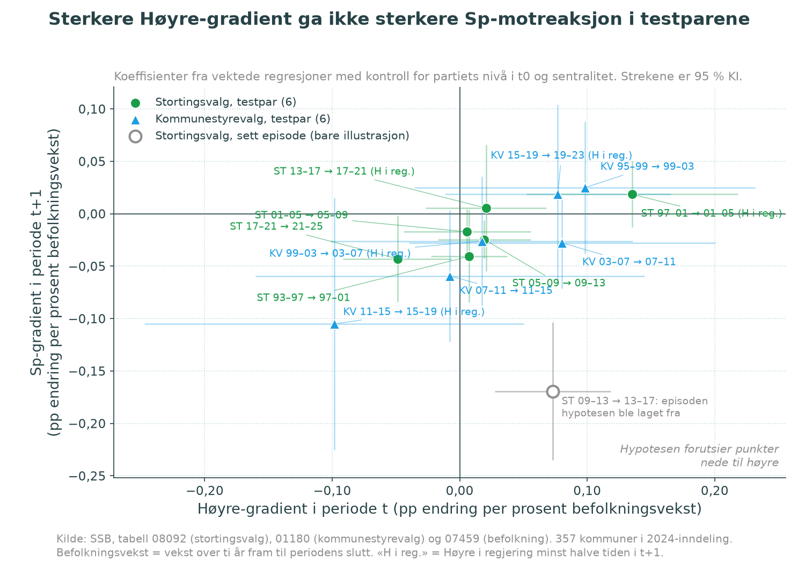
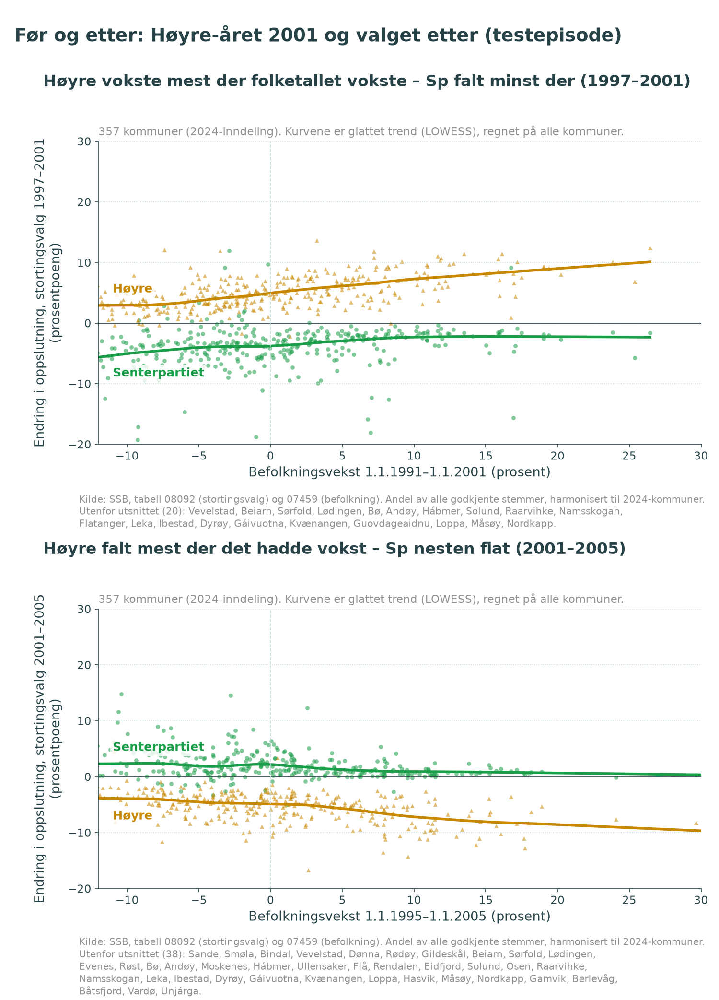

# Rapport: Høyre-mobilisering i vekstkommuner → Sp-motreaksjon?

*Kjørt 2026-09-26. Låst operasjonalisering: `låst.json` (låst 17:07 UTC, før episodene ble sett; commit a299ecb). Kode: `analyse/kv_panel.py`, `analyse/motreaksjon_las.py`, `analyse/motreaksjon_kjor.py`, `analyse/figur_motreaksjon.py`. Resultater: `parvis.csv`, `resultater.json`.*

## Svar i én setning

**Mønsteret fra 2009–13 → 2013–17 går ikke igjen.** I ingen av de 12 testparene (6 stortingsvalg, 6 kommunestyrevalg) fulgte en robust Sp-gradient mot nedgangskommuner etter en robust Høyre-gradient mot vekstkommuner, og de sterkeste Høyre-gradientene ble tvert imot fulgt av de *svakeste* Sp-gradientene.

## Tabell per periodepar

Høyre-gradient i *t* = b for `vekst10_pst` i `d_h ~ vekst10_pst + h_t0 + sent_indeks`, og Sp-gradient i *t+1* = b for `vekst10_pst` i `d_sp ~ vekst10_pst + sp_t0 + sent_indeks`. Begge er vektet med godkjente stemmer i t0 og har klyngerobuste SE på kommune. Enheten er prosentpoeng endring per prosent befolkningsvekst over ti år. Tallene i parentes er 95 % KI. p (Holm) er justert over 26 låste tester. «Robust» betyr Holm-p < 0,05 og samme fortegn som forventet når estimatet er uvektet, uten estimerte kommuner og med hvert av de 15 fylkene utelatt. «H i reg.» er andelen av tiden i *t+1* med Høyre i regjering. «Biv. r» er den ukontrollerte korrelasjonen (som i figurene). Den er beskrivende og ikke låst.

| Valgslag | Par (t → t+1) | Rolle | Høyre-gradient i t | p (Holm) | Sp-gradient i t+1 | p (Holm) | H i reg. | Robust P1 / P2 | Biv. r H(t) / Sp(t+1) |
|---|---|---|---|---|---|---|---|---|---|
| ST | 1993–97 → 1997–01 | test | +0,007 (−0,022; 0,037) | 1,00 | −0,041 (−0,085; 0,003) | 1,00 | 0,00 | nei / nei | −0,21 / +0,20 |
| ST | 1997–01 → 2001–05 | test | **+0,135 (0,052; 0,218)** | **0,036** | +0,019 (−0,013; 0,050) | 1,00 | 0,97 | **ja** / nei | +0,57 / −0,27 |
| ST | 2001–05 → 2005–09 | test | +0,006 (−0,044; 0,056) | 1,00 | −0,017 (−0,039; 0,004) | 1,00 | 0,03 | nei / nei | −0,43 / −0,04 |
| ST | 2005–09 → 2009–13 | test | +0,019 (−0,017; 0,056) | 1,00 | −0,025 (−0,043; −0,006) | 0,19 | 0,00 | nei / nei | +0,04 / +0,04 |
| ST | *2009–13 → 2013–17* | *sett* | *+0,073 (0,027; 0,118)* | *–* | *−0,169 (−0,235; −0,104)* | *–* | *0,98* | *ja / ja (ujustert)* | *+0,36 / −0,54* |
| ST | 2013–17 → 2017–21 | test | +0,021 (−0,027; 0,068) | 1,00 | +0,005 (−0,055; 0,066) | 1,00 | 1,00 | nei / nei | +0,10 / +0,01 |
| ST | 2017–21 → 2021–25 | test | −0,049 (−0,091; −0,006) | 0,59 | −0,043 (−0,084; −0,002) | 0,93 | 0,02 | nei / nei | −0,09 / +0,38 |
| KV | 1995–99 → 1999–03 | test | +0,098 (−0,036; 0,232) | 1,00 | +0,025 (−0,038; 0,088) | 1,00 | 0,47 | nei / nei | +0,03 / +0,01 |
| KV | 1999–03 → 2003–07 | test | +0,017 (−0,101; 0,136) | 1,00 | −0,026 (−0,088; 0,035) | 1,00 | 0,53 | nei / nei | +0,01 / −0,07 |
| KV | 2003–07 → 2007–11 | test | +0,080 (−0,040; 0,201) | 1,00 | −0,028 (−0,071; 0,016) | 1,00 | 0,00 | nei / nei | +0,08 / 0,00 |
| KV | 2007–11 → 2011–15 | test | −0,008 (−0,160; 0,145) | 1,00 | −0,059 (−0,122; 0,003) | 1,00 | 0,48 | nei / nei | +0,18 / −0,14 |
| KV | 2011–15 → 2015–19 | test | −0,098 (−0,247; 0,050) | 1,00 | −0,105 (−0,225; 0,015) | 1,00 | 1,00 | nei / nei | −0,22 / −0,01 |
| KV | 2015–19 → 2019–23 | test | +0,077 (−0,012; 0,165) | 1,00 | +0,018 (−0,067; 0,104) | 1,00 | 0,52 | nei / nei | −0,06 / +0,02 |

De første parene i hvert valgslag (ST 1989–93 → 1993–97, KV 1987–91 → 1991–95 og KV 1991–95 → 1995–99) mangler tiårsvekst i *t*, fordi befolkningstallene starter i 1986. De inngår bare i sensitiviteten med fireårsvekst, som er beskrivende og ikke Holm-testet. Der er Høyre-gradienten null i alle tre (+0,022, −0,040 og +0,130, alle KI omfatter 0). Sp-gradienten i *t+1* er negativ i alle tre (−0,32, −0,21 og −0,17). Det er Sp-bølgen på begynnelsen av 1990-tallet: sterk Sp-gradient **uten** forutgående Høyre-gradient.

## P1–P5: status

| Del | Påstand | Status | Grunnlag |
|---|---|---|---|
| **P1** | Høyres endring i *t* øker med befolkningsvekst | **Sjelden.** Robust i 1 av 12 testpar (ST 1997–2001) | b > 0 i 9 av 12, men KI omfatter 0 i 11 av 12. I KV finnes ingen Høyre-gradient av betydning, heller ikke i Høyre-bølgen 2007–11 (−0,008). |
| **P2** | Sps endring i *t+1* avtar med befolkningsvekst | **Ikke støttet.** Robust i 0 av 12 testpar | Negativt fortegn i 8 av 12, men små tall (typisk −0,02 til −0,06 mot −0,17 i den sette episoden). Ingen overlever Holm. |
| **P1 → P2** (§4.4) | Retningen går igjen i flertallet av testparene i begge valgslag | **Ikke støttet:** 0 av 6 (ST), 0 av 6 (KV) | Det eneste paret med robust P1 (ST 1997–01 → 2001–05) har Sp-gradient +0,019 i 2001–05. |
| **P3** | Sterkere Høyre-gradient i *t* → mer negativ Sp-gradient i *t+1* (parnivå) | **Ikke støttet. Motsatt fortegn (beskrivende)** | Korrelasjon over testparene: ST r = +0,83 (Spearman +0,83), KV r = +0,93 (+0,83), samlet r = +0,86 (n = 12). Med den sette episoden i ST: r = −0,01. Hele den negative sammenhengen i det opprinnelige bildet kommer altså fra episoden hypotesen ble laget fra. Med 6 punkter per valgslag er dette beskrivende. Punktene ligger også tett, og KI-ene overlapper. |
| **P4** | Lokal motreaksjon: Sps endring i *t+1* mot Høyres residual i *t* | **Formelt «delvis» etter den låste regelen, i praksis ikke støttet** | Samlet over testparene: ST b = +0,048 (−0,092; 0,189), Holm-p = 1,0; KV b = +0,021 (−0,042; 0,084), Holm-p = 1,0. Begge peker svakt mot versjon B (Sp går mer fram der Høyre gikk *mer* fram), men KI er vide og omfatter 0. Fortegnet snur uvektet i ST. Regelen «samme fortegn i begge uten robusthet = delvis» var for raus. Den ble låst slik og rapporteres slik, men den bærer ikke noen konklusjon. |
| **P5** | Motreaksjonen er sterkere med Høyre i regjering | **Delvis (beskrivende), sprikende** | ST: snitt Sp-gradient +0,012 med Høyre i regjering (2 par) mot −0,031 uten (4 par), altså **motsatt** av forventet. KV: −0,038 med (3 par) mot −0,021 uten (3 par), altså som forventet, men forskjellen er liten mot KI-ene og drives av KV 2015–19. De to ST-parene med Høyre i regjering (2001–05 og 2017–21) har Sp-gradient på null. |

## Konkurrerende forklaringer

**(a) Sps egen bølge, eller regresjon mot middelverdien.** På parnivå følger Sp-gradienten i *t+1* størrelsen på Sps nasjonale bølge i KV: r = −0,85 mot nasjonal Sp-endring (større bølge, brattere nedgangsgradient). I ST går den motsatt vei (r = +0,80), men det drives av 2021–25, da Sp tapte minst i nedgangskommuner. Kontroll for Sps egen endring i *t* endrer ikke P4 (ST +0,064, KV +0,005, begge KI omfatter 0). Sp-bølgen på begynnelsen av 1990-tallet hadde sterk nedgangsgradient uten noen Høyre-gradient foran seg (se over). Til sammen ligner Sp-gradienten mer på et kjennetegn ved Sp-bølger enn på et svar på Høyre.

**(b) Ap-tap.** Den sette episoden er følsom for Ap. Med `d_ap(t)` og `ap_t0` som kontroll krymper Sp-gradienten i 2013–17 fra −0,169 til −0,056 (−0,119; 0,006). Det er to tredeler mindre, og KI omfatter 0. Det passer med H31 i `turnering/RAPPORT.md` (Sp-bølgen 2013–21 gikk gjennom Ap-land). I testparene endrer Ap-kontrollen lite, fordi det er lite å forklare. Unntaket er ST 2017–21, der gradienten med Ap-kontroll blir +0,063 (0,004; 0,121), altså motsatt av hypotesen. P4 med Ap-kontroll: ST +0,050, KV +0,039, begge KI omfatter 0.

**(c) Reformer uavhengig av Høyres valgresultat.** Kommunereformen 2017–2020 er målt som en egen dummy for sammenslåtte kommuner (47 av 357). Den endrer ikke Sp-gradienten i ST 2017–21 (+0,005 før og etter). Reformkommunene selv hadde ingen tydelig egen Sp-utvikling: ST 2017–21 +0,005 pp (−0,81; 0,82), KV 2015–19 −0,46 pp (−2,07; 1,14) og KV 2019–23 −0,56 pp (−1,59; 0,47). Andre reformer, som politi, sykehus og regionreformen, kan ikke skilles fra regjeringsperioden med disse dataene. Det gjør P5 uskarp i utgangspunktet.

## Hva med testepisoden 1997–2001 → 2001–2005?

Dette er det eneste testparet der Høyre robust mobiliserte i vekstkommuner (P1: +0,135, bivariat r = +0,57), og Høyre gikk deretter i regjering (Bondevik II). Bivariat går Sp også litt mer fram i nedgangskommuner i 2001–05 (r = −0,27). Men når Sps nivå og sentralitet holdes fast, forsvinner Sp-gradienten (+0,019). Det Sp-mønsteret figuren viser, er dermed Sps vanlige periferiprofil og ikke en motreaksjon. Det som skjer tydeligst i 2001–05, er at *Høyre* falt mest der partiet hadde vokst mest. Det er regresjon for Høyre, ikke et utslag for Sp.

## Forbehold

- **Kommunenivå.** Alle sammenhenger gjelder kommuner og ikke velgere. Resultatene sier ingenting om at velgere gikk fra Høyre til Sp eller omvendt.
- **Få episoder.** Det er 6 testpar per valgslag. P3 og P5 er beskrivende, og korrelasjoner over 6 punkter kan snu av ett enkelt par. Den positive P3-korrelasjonen skal ikke leses som et funn i seg selv. Poenget er at den ikke er negativ.
- **Hypotesen ble formulert etter å ha sett data.** Episoden 2009–13 → 2013–17 er bare illustrasjon. Tidligere arbeid i repoet (H32 i turneringen) hadde også vist at Sp-gradienten mot nedgang var sterk i 1989–93 og 2013–17, men ikke i 2017–21. Noe av utfallet i *t+1* var derfor delvis kjent før låsing, men ikke koblingen til Høyre i *t*.
- **Spesifikasjonen har kontroller.** Figurene er bivariate. Den låste testen kontrollerer for partiets nivå og sentralitet, og det er et strengere krav. Bivariat finnes en Høyre-gradient i ST 1997–2001 og en svak Sp-gradient i 2001–05, men ikke i de andre testparene (se kolonnen «Biv. r»). Konklusjonen holder derfor også uten kontrollene, med unntak av dette ene paret.
- **Vekting.** Høyre-gradienten i den sette episoden er mye svakere uvektet (+0,018 mot +0,073 vektet). Den drives altså av de store kommunene.
- **Tiårsvekst overlapper** mellom *t* og *t+1* (seks av ti år er felles). Det gjør de to gradientene mer like enn de ellers ville vært, og det virker *i favør* av en kobling. Koblingen uteble likevel.
- **Regjeringsbetingelsen** er målt grovt: andel tid, med valgdag satt til 10. september. KV-perioder får «Høyre i regjering» nær 50 % i flere par (0,47–0,53), så delingen er skjør.
- **Holm over 26 tester** er strengt. Men også uten justering er bare to av tolv P2-estimater signifikante på 5 %-nivå (ST 2005–09 → 2009–13 og ST 2017–21 → 2021–25), og ingen av dem følger en robust Høyre-gradient.

## Kontroll og dekning

KONTROLL_PLASSHOLDER
