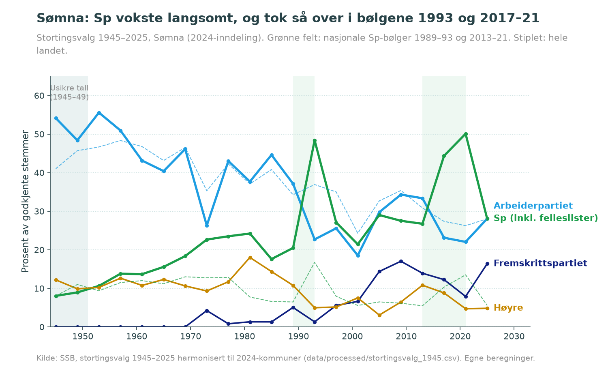
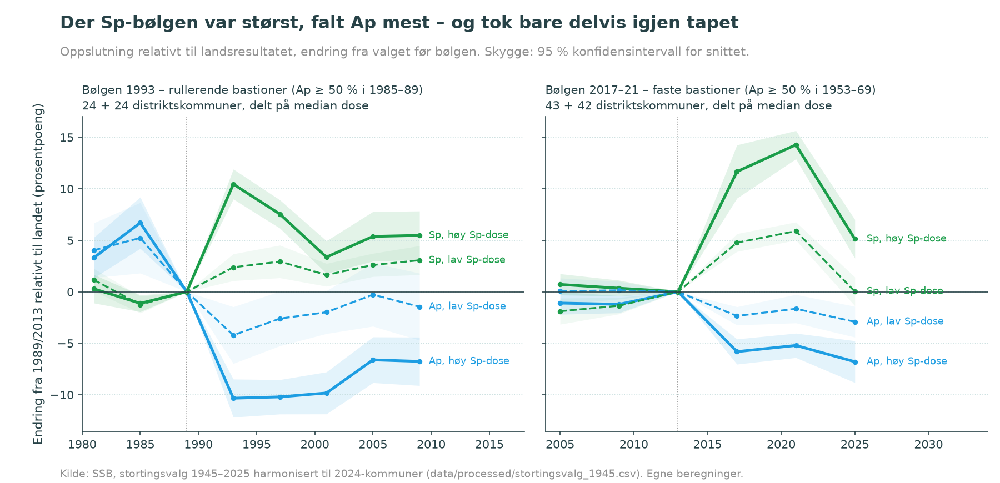
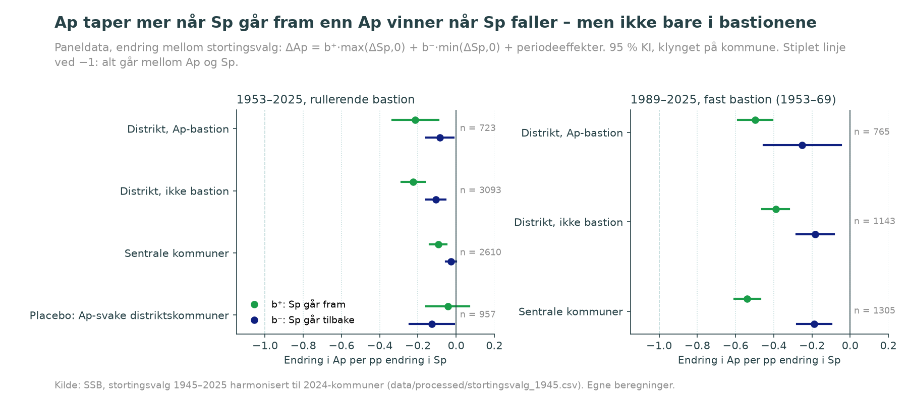
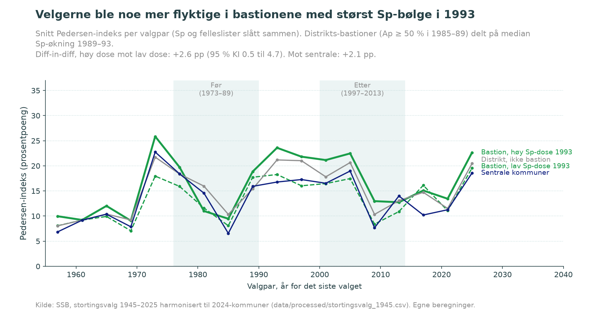
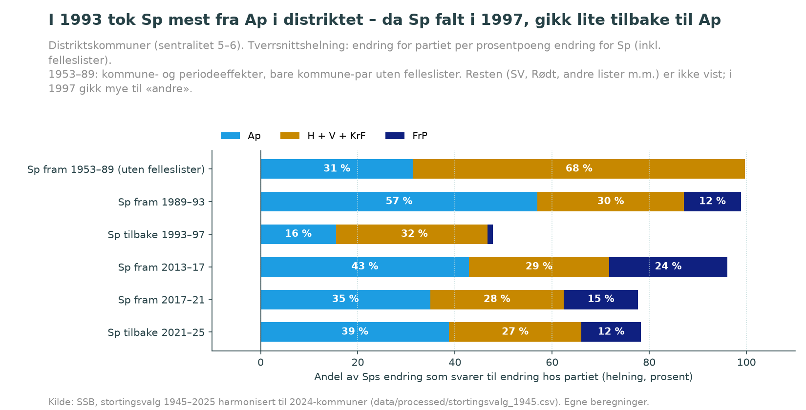
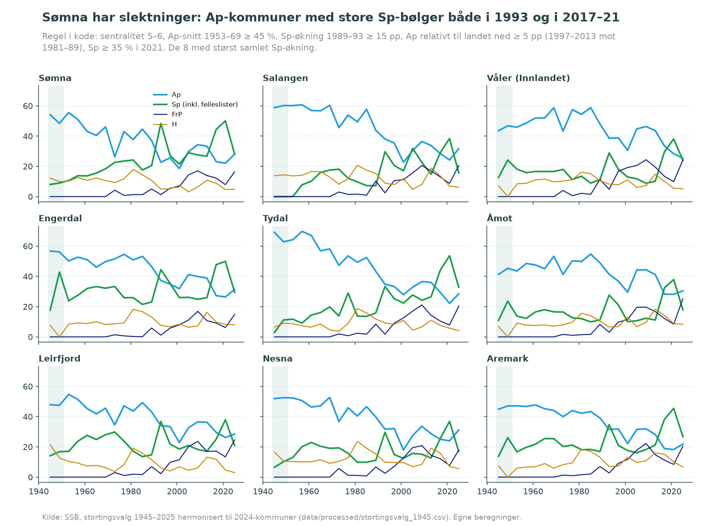

# Sp som «ventil» for Ap-bastioner i distriktet – og velgere som ikke kommer tilbake

*2026-09-27. Undersøkelsen følger [`PROMPT.md`](PROMPT.md), med standardsvarene i §9. Datasettet er beskrevet i [`../../utvidelse_1945/QA_RAPPORT.md`](../../utvidelse_1945/QA_RAPPORT.md).
Definisjonene ble låst i [`låst.json`](låst.json) før testene ble kjørt. Alle tall er regnet i `analyse/sp_ventil/` og står i [`arbeid/resultater.json`](arbeid/resultater.json).
Rapporten gjengir tall derfra og regner ingen nye tall i tekst.*

## Sammendrag

**Påstanden** kommer fra Sømna: kommunen stemte Ap i lang tid, fikk så en periode med Sp-fremgang, og etterpå kom velgerne ikke tilbake til Ap.
Påstanden er delt i tre ledd: P1 erosjon, P2 sperrehake og P3 løsere velgere. Undersøkelsen er **deskriptiv** og bygger på aggregerte kommunetall for 1953–2025.
Tallene viser nettoendringer per kommune, ikke at det er *de samme velgerne* som går fra Ap til Sp og videre (se [Hva aggregerte data ikke kan vise](#hva-aggregerte-data-ikke-kan-vise)).

| Ledd | Konklusjon | Kjernen i én setning |
|---|---|---|
| **P1 Erosjon** | **Delvis støttet** | I 1993 kom ca. 57 % av Sps framgang i distriktet fra Ap, i bastionene ca. 75 %. Der var helningen nær −1 (−0,84 med rullerende definisjon) og signifikant brattere enn i andre distriktskommuner (−0,31). I 2017–21 tok Sp mindre fra Ap (ca. 30–43 %), og bastionene skilte seg ikke ut. |
| **P2 Sperrehake** | **Delvis støttet** | Etter 1993 kom Ap ikke tilbake der Sp-dosen var størst: forskjellen mellom bastioner med høy og lav dose holdt seg på 5–8 pp til 2009. Bare 16–19 % av Sps tilbakegang i 1997 gikk til Ap. Etter 2021 var mønsteret ikke der: i 2025 gikk 39–52 % av Sps tilbakegang til Ap. Asymmetrien i panelet gjelder hele landet etter 1989, ikke særlig bastionene. Den forsvinner med Sp alene, og kommunevalgene gjentar den ikke. |
| **P3 Løsere velgere** | **Svakt / delvis støttet** | Velgerne ble noe mer flyktige i bastionene med høy dose (Pedersen +2 til +3 pp mot sammenligningsgruppene). Resultatet avhenger av hvordan gruppene deles, og FrP- og H-utslagene ble ikke større. Kommuner med stor bølge i 1993 fikk også noe større bølge i 2017–21. |

**T8-nyansen (1953–89):** Sps langsomme vekst før 1989 kom i hovedsak fra H, V og KrF. I kommune-par uten felleslister svarte endringen i H + V + KrF til ca. 2/3 av Sps endring (helning −0,68), og Ap til ca. 1/3 (helning −0,31). Ap tok også raskt igjen det lille tapet etter tidlige lokale Sp-bølger.
**1993 er derfor et brudd, ikke en fortsettelse:** Det var første gang Ap var hovedkilden, og første gang Ap ikke tok tapet igjen.
Sømna er et unntak her: Ap falt jevnt allerede fra 1953, samtidig som Sp vokste (se figur 1).

## Figurer

| | |
|---|---|
|  | **Figur 1.** Sømna 1945–2025: Ap, Sp (inkl. felleslister), FrP og H, med landstallene stiplet. |
|  | **Figur 2.** Hendelsesstudie rundt 1993 og 2017–21 for distrikts-bastioner med høy og lav Sp-dose (T4). |
|  | **Figur 3.** Asymmetrikoeffisientene b⁺ og b⁻ med 95 % KI per kommunegruppe (T2). |
|  | **Figur 4.** Volatilitet (Pedersen) før og etter 1993 (T5). |
|  | **Figur 5.** Hvor kom Sp-framgangen fra, og hvor gikk tilbakegangen (T1, T6, T8)? |
|  | **Figur 6.** Sømna og åtte kommuner med samme mønster, valgt etter regel i kode (T7). |

## Data og operasjonalisering

- **Data:** `stortingsvalg_1945.csv` (hovedvariant) og `kommunestyrevalg_1945.csv` (parallell), 357 kommuner (2024-inndeling), 21 valg.
  Panelet `arbeid/panel.csv` har 7 139 rader (kommune × valgpar). Dataordboken er [`arbeid/datadictionary.md`](arbeid/datadictionary.md).
  Testene bruker valgpar fra 1953–57. Valgene 1945 og 1949 (sikkerhet «lav») er bare bakgrunn.
- **Distrikt:** sentralitetsklasse 5–6 (212 kommuner). **Sentrale:** klasse 1–4 (145).
- **Bastion (hoveddefinisjon, rullerende):** Ap-snittet ved de to valgene før valget som testes, ≥ 50 %.
  Robusthetsvarianter: fast definisjon (snitt 1953–69 ≥ 50 %, 85 distriktskommuner), øvre kvartil og grensene 45/55 %.
- **Sp-mål:** Hovedvarianten er Sp + felleslister (gruppe 90). Hele gruppe 90 regnes da til Sp, selv om listene også rommet KrF og V. «Sp alene» er med som variant.
  Etter 1985 er de to variantene like, fordi det ikke fantes felleslister.
- **Nasjonale bølger** (Sp + felleslister ≥ 3 pp) er 1989–93, 2013–17 og 2017–21, med tilbakefall i 1993–97 og 2021–25. Dette er låst.
  **Lokal bølge:** Sp + felleslister går fram ≥ 10 pp i kommunen. 205 distriktskommuner hadde minst én slik bølge. For 108 av dem kom den første i 1993.
- **Endringer** måles i prosentpoeng, med periodeeffekter eller relativt til landsendringen. Standardfeilene er klynget på kommune i panelmodellene og HC1 i tverrsnitt.

**Viktig begrensning i definisjonen:** Med den rullerende definisjonen finnes det 48 distrikts-bastioner ved valget i 1993, men bare 5 i 2017 og 1 i 2021. Ap sto rett og slett ikke lenger over 50 % noe sted.
Testene av 2017–21-bølgen bruker derfor den faste definisjonen (1953–69). Det er merket der det gjelder.
**Sømna er ikke bastion etter hoveddefinisjonen.** Ap-snittet der var 47,2 % i 1953–69 og 40,9 % før 1993. Kommunen kommer bare med når grensen er 45 %.

## P1 Erosjon (T1)

**Helningen for ΔAp mot ΔSp, tverrsnitt per bølge.** −1 betyr at hele Sps framgang svarer til Aps tilbakegang.

| Bølge | Distrikt, bastion (rullerende) | Distrikt, bastion (fast 1953–69) | Distrikt, ikke bastion (rull.) | Sentrale |
|---|---|---|---|---|
| 1989–93 | **−0,84** (−1,06; −0,62), n = 48 | −0,75 (−0,91; −0,60), n = 85 | −0,53 (−0,63; −0,43), n = 164 | −0,54 (−0,67; −0,42) |
| 2013–17 | (n = 5) | −0,41 (−0,45; −0,37) | −0,43 (−0,49; −0,36) | −0,64 (−0,74; −0,54) |
| 2017–21 | (n = 1) | −0,31 (−0,43; −0,19) | −0,35 (−0,45; −0,25) | −0,28 (−0,46; −0,09) |

- **1993:** Helningen er brattere i bastionene enn ellers i distriktet. Innen distriktet (bastion mot ikke-bastion) er interaksjonen **−0,31** (KI −0,55 til −0,07, p = 0,01) med rullerende definisjon og **−0,31** (KI −0,49 til −0,12) med fast.
  Målt mot alle andre kommuner, sentrale inkludert, er den svakere: −0,21 (KI −0,43 til 0,02) og −0,14 (ns). K påpekte denne forskjellen, og innen-distrikt-målet er lagt til etter kontrollen.
  Dekomponeringen i distriktet viser hvor gevinsten kom fra: Ap 57 %, H 18 %, FrP 12 %, KrF 8 %. I de faste bastionene kom 75 % fra Ap.
- **2013–17 og 2017–21:** Ap-tapet var 43 % og 35 % av Sp-gevinsten i distriktet. Bastionene skilte seg ikke ut: interaksjonen innen distriktet er +0,02 og +0,08, altså ikke brattere.
  H (29–30 %) og FrP (15–24 %) bidro mer enn i 1993.
- **Lokale bølger 1953–2025** (Sp ≥ 10 pp i kommunen), relativt til landet: I rullerende distrikts-bastioner svarte Aps tap til 49 % av Sps gevinst (n = 89). I andre distriktskommuner var andelen 41 %, og i sentrale 20 %.
- **Kommunestyrevalg (parallell):** Helningen i faste distrikts-bastioner var −0,21 i 1967–71, −0,05 (ikke signifikant) i 1987–91 og −0,38 i 2015–19. P1 er altså svakere i kommunevalgene.
- **Robusthet (1993, distrikts-bastion):**

  | Variant | Helning |
  |---|---|
  | Stabile enheter | −0,83 |
  | Bare høy sikkerhet | −0,84 |
  | Bastiongrense 45 % | −0,78 |
  | Bastiongrense 55 % | −0,91 |
  | Øvre kvartil | −0,75 |
  | Ett fylke ute, spenn | −0,96 til −0,76 |

**Vurdering:** *Delvis støttet.* Erosjonen fra Ap var tydelig og nær −1 i bastionene i 1993. I bølgen 2017–21 var den mer spredt, og bastionene skilte seg ikke ut.

## P2 Sperrehake (T2, T3, T4, T6)

**T2 Asymmetri i panelet** (ΔAp = b⁺·max(ΔSp,0) + b⁻·min(ΔSp,0) + periodeeffekter, alle valgpar 1953–2025). asym = b⁻ − b⁺, og en positiv verdi betyr at Ap tar igjen mindre enn partiet tapte.

| Gruppe | b⁺ | b⁻ | asym (p) | n |
|---|---|---|---|---|
| Distrikt, bastion (rullerende) | −0,21 | −0,09 | 0,13 (p = 0,08) | 723 |
| Distrikt, bastion (fast) | −0,28 | −0,12 | 0,16 (p = 0,002) | 1 530 |
| Distrikt, ikke bastion (rull.) | −0,23 | −0,11 | 0,12 (p < 0,001) | 3 093 |
| Sentrale | −0,09 | −0,03 | 0,07 (p = 0,004) | 2 610 |
| **Placebo:** Ap-svake distriktskommuner | −0,04 | −0,13 | −0,09 (p = 0,29) | 957 |

- **Asymmetrien finnes bare etter 1989.** I 1953–89 er asym 0,02 (p = 0,75) i distrikts-bastionene.
  I 1989–2025 er den 0,42 (p = 0,03) i rullerende bastioner, som bare har n = 78, og 0,25 (p = 0,06) i faste. I sentrale kommuner er den 0,35 (p < 0,001).
  **Sperrehaken er altså et trekk ved perioden etter 1989 i hele landet, ikke særlig for distrikts-bastionene.**
- **Placeboen** (Ap-svake kommuner, der regresjon mot gjennomsnittet ikke kan gi fall i Ap) viser ingen asymmetri. Det taler mot at funnet bare skyldes regresjon mot gjennomsnittet.
- **Kommune-FE:** Resultatet er det samme i fast definisjon (asym 0,17, p = 0,002). I rullerende bastioner er asym 0,11 (p = 0,20).
- **Sp alene** (uten felleslister): **Her forsvinner asymmetrien i distrikts-bastionene** (−0,01, p = 0,78). K flagget dette som det viktigste grensevalget. Konklusjonen om sperrehake *i distrikts-bastionene over hele perioden* holder bare med Sp + felleslister. Før 1989 blandes Sp-endringen med overganger mellom egen liste og felleslister. Blant par uten felleslister 1953–89 er asym 0,15 (p = 0,28) i bastionene.
- **Kommunestyrevalg:** Rullerende bastioner har asym 0,20 (p = 0,02), men faste bastioner (fra ST) bare 0,03 (p = 0,46). For 1987–2023 er asym −0,02 i faste bastioner. **KV gjentar ikke sperrehaken.**

**T3 Dose–respons (1989–93).** Tverrsnittet måler effekten av Sp-økningen 1989–93 på Aps endring fra 1989 til et senere år, kontrollert for Ap i 1989 og befolkningsendring.

| Gruppe | Ap til 1993 | Ap til 1997 | Ap til 2001 | Ap til 2005 | Ap til 2009 | Ap til 2013 | Sp til 2009 |
|---|---|---|---|---|---|---|---|
| Distrikts-bastion, rullerende (n = 48) | −1,00 | −1,02 | −0,97 | −1,00 | −0,80 | −0,85 | 0,24 |
| Distrikts-bastion, fast (n = 85) | −0,93 | −0,81 | −0,74 | −0,80 | −0,63 | −0,65 | 0,24 |
| Alle distrikt (n = 212) | −0,60 | −0,48 | −0,47 | −0,39 | −0,21 | −0,28 | 0,20 |
| Sentrale (n = 145) | −0,72 | −0,57 | −0,35 | −0,42 | −0,47 | −0,36 | 0,07 |

I bastionene henger 1993-dosen fortsatt nesten én-til-én sammen med lavere Ap 16–20 år senere. Samtidig har den gjenværende Sp-effekten falt til ca. en firedel.
Velgerne som forlot Ap i disse kommunene, ble altså i stor grad ikke hos Sp, men de kom heller ikke tilbake til Ap.
For bølgen 2013–21 i faste bastioner er dose-effekten −0,38 i 2021 og −0,17 (KI −0,51 til 0,18) i 2025. Det tyder på delvis retur, men bygger på bare ett valg.

**T4 Hendelsesstudie** (figur 2, Ap relativt til landet, endring fra 1989). Tabellen viser rullerende distrikts-bastioner med høy og lav dose (24 + 24):

| | 1985 | 1993 | 1997 | 2001 | 2005 | 2009 |
|---|---|---|---|---|---|---|
| Høy dose (Sp +20,7 pp) | 6,7 | −10,3 | −10,2 | −9,8 | −6,6 | −6,8 |
| Lav dose (Sp +12,7 pp) | 5,2 | −4,2 | −2,6 | −2,0 | −0,3 | −1,5 |
| Forskjell | 1,5 | −6,1 | −7,6 | −7,8 | −6,3 | −5,3 |

Før bølgen hadde de to gruppene samme utvikling: forskjellen var −0,7 i 1981 og 1,5 i 1985. Ingen av gruppene nådde nivået fra 1989 igjen, og gruppen med høy dose lå lengst unna.
Bølgen 2017–21 (faste bastioner, 43 + 42) gir en forskjell på −3,5 i 2017, −3,6 i 2021 og −3,9 i 2025.
**Stablet over alle første lokale bølger:** I distrikts-bastionene lå Ap −4,6 pp under kontrollgruppen ved bølgen og −2,1 pp tre valg senere.
For bølger før 1989 var det bare −1,6 pp ved bølgen, og forskjellen var borte etterpå.

**T6 Hvor gikk Sp-velgerne da Sp falt?** Tabellen viser andelen av Sps tap som svarer til gevinst hos partiet (tverrsnittshelning).

| | Ap | FrP | H | KrF | Andre |
|---|---|---|---|---|---|
| 1993–97, alle distrikt | **16 %** | −1 % | −1 % | 26 % | 47 % |
| 1993–97, faste bastioner | **19 %** | −6 % | 3 % | 22 % | 66 % |
| 2021–25, alle distrikt | **39 %** | 12 % | 23 % | 2 % | 4 % (Rødt 14 %) |
| 2021–25, faste bastioner | **52 %** | 11 % | 12 % | 1 % | 8 % (Rødt 17 %) |
| Lokale tilbakefall 1957–89, distrikt | 3 % | – | 48 % | 17 % | V 37 % |

Merk: Forholdstallet «andel_tilbake» (b⁻/b⁺) i `resultater.json` er ustabilt når b⁺ er nær null, for eksempel i sentrale kommuner 1953–89. Det bør ikke tolkes der (K).

**Symmetrien direkte:** I 1993 kom 75 % av Sps framgang i de faste bastionene fra Ap, men bare 19 % av tilbakegangen i 1997 gikk til Ap.
Etter 2021 var mønsteret motsatt: i 2017–21 kom 31 % fra Ap, og i 2025 gikk 52 % tilbake.
I 1997 fanget «andre» mye i bastionene. Det er lokale og tverrpolitiske lister i Nord-Norge, som ikke er undersøkt nærmere her.

**Vurdering:** *Delvis støttet.* Sperrehaken er tydelig for 1993-bølgen i distrikts-bastionene (T3, T4, T6), men ikke for 2017–21-bølgen, der bare ett valg etter bølgen finnes.
Den generelle asymmetrien i panelet (T2) finnes etter 1989 i alle kommunegrupper, også sentrale, og gjentas ikke i kommunevalgene.

## P3 Løsere velgere (T5)

**Pedersen-indeks** med Sp og felleslister slått sammen. Før = 1973–89, etter = 1997–2013. Parene med bølgen og tilbakefallet (1989–97) er utelatt. DiD er med periode- og kommuneeffekter.

| «Rammet» (distrikts-bastion) mot | Grense for dose ≥ 10 pp (hoved) | Median-deling (15,4 pp) | Median, fast bastion (17,5 pp) |
|---|---|---|---|
| (a) bastioner med lav dose | +0,3 (KI −2,9; 3,5), **bare n = 5** | **+2,6** (0,5; 4,7) | **+3,4** (1,7; 5,2) |
| (b) distrikt, ikke bastion | +0,9 (−0,5; 2,2) | **+2,1** (0,4; 3,9) | **+2,2** (0,9; 3,6) |
| (c) sentrale | +0,9 (−0,4; 2,2) | **+2,1** (0,4; 3,9) | **+2,2** (0,9; 3,5) |
| Utslag hos andre partier enn Sp, mot (b) | +0,2 (ns) | +1,2 (p = 0,07) | **+1,6** (p = 0,007) |

- Med den låste grensen på 10 pp fikk nesten alle bastionene «dose» i 1993. Sammenligningsgruppe (a) får da bare 5 kommuner, og DiD er ikke signifikant.
  Med median-deling, som også brukes i T4, er økningen +2 til +3 pp. Nivået før bølgen var 13–15 (se `resultater.json` → T5 → median_deling → snitt), men resultatet avhenger av delingen.
- **Første lokale bølge, forskjøvet over alle år:** Pedersen er +1,2 pp høyere etter bølgen (KI 0,4–2,0) i distriktet. For kommuner med første bølge i 1993 er økningen +1,0 (p = 0,07). For kommuner med første bølge før 1989 er den +0,5 (ns).
- **Mot Sp:** Sp-økningen i 1993 henger svakt sammen med økningen i 2013–21 (helning 0,18, KI 0,03–0,33, korrelasjon 0,16). De rammede bastionene fikk 18,8 pp i den nye bølgen, mot 15,0 i andre distriktskommuner.
- **Mot FrP og H:** Snittet av |ΔFrP| etter 1997 var 3,7 pp i rammede bastioner, mot 4,4–4,6 i sammenligningsgruppene. For |ΔH| var tallene 4,6 mot 4,9–6,5. **Utslagene mot FrP og H var altså ikke større.**
- **Nasjonalt (individdata, L):** Andelen partibyttere steg fra 19 % (1977–81) til 39 % (2021–25), ifølge SSB-tabell 11665. Økt flyktighet er en landsdekkende trend, som periodeeffektene fjerner.
- **Mekanisk forbehold:** Kommuner med høy dose hadde et høyere Sp-nivå etterpå, og dermed mer å svinge med. Varianten uten Sp («utslag hos andre partier») har mindre effekt.

**Vurdering:** *Svakt / delvis støttet.* Velgerne ble noe mer flyktige og fikk noe større nye Sp-bølger der 1993-dosen var høy. Resultatet avhenger av gruppedelingen, og det gjelder ikke utslag mot FrP og H.

## T8 Langsom drift 1953–89: fortsettelse eller brudd?

| Mål | Ap | H + V + KrF |
|---|---|---|
| Helning mot ΔSp, alle par 1953–89 i distriktet, Sp + felleslister (kommune- og periode-FE) | −0,08 | −0,91 |
| Samme, **bare kommune-par uten felleslister** (Sp = Sp + fl) | **−0,31** (−0,43; −0,20) | **−0,68** (−0,79; −0,58) |
| Samme uten felleslister, faste distrikts-bastioner | −0,42 (−0,59; −0,25) | −0,66 (−0,79; −0,54) |
| Til sammenligning: tverrsnitt 1989–93, faste distrikts-bastioner | −0,75 | H −0,22, KrF −0,06, V −0,04 |

- Varianten med felleslister overdriver H + V + KrF mekanisk, fordi velgerne deres flytter inn på felleslister som her regnes som Sp. Varianten uten felleslister er derfor den relevante.
  Der svarer Sps langsomme vekst for ca. 1/3 til tap for Ap og 2/3 til tap for H, KrF og V. I bastionene er Ap-andelen litt høyere (0,42).
- Asymmetrien i 1953–89 er ubetydelig (T2). Etter tidlige lokale bølger tok Ap raskt igjen det lille tapet (T4, stablet). Når Sp falt lokalt før 1989, gikk tapet til H (48 %) og V (37 %), ikke til Ap (3 %).
- I snitt sto Sp nesten stille i distriktskommunene fra 1953 til 1989 (−1,4 pp), mens Ap falt 8,7 pp. Bare 29 distriktskommuner hadde Sømna-lignende vekst (≥ 5 pp). Der falt Ap 11,4 pp, mot 9,4 pp i snitt for alle kommuner.
- **Konklusjon T8:** 1993 er et **brudd**. Sp hadde vokst langsomt, mest på bekostning av de borgerlige og sentrum. I 1993 ble Ap hovedkilden, og etter 1993 kom Ap ikke tilbake der dosen var høy.
  Sømna er et av få unntak som passer til en «fortsettelse»: Ap falt fra 55,6 % (1953) til 37,1 % (1989), mens Sp + felleslister steg fra 10,6 % til 20,5 %.

## T7 Sømna og tilsvarende kommuner

Regelen i kode krever:
- sentralitet 5–6
- Ap-snitt 1953–69 ≥ 45 %
- Sp-økning 1989–93 ≥ 15 pp
- Ap relativt til landet ned ≥ 5 pp (1997–2013 mot 1981–89)
- Sp ≥ 35 % i 2021

18 kommuner oppfyller regelen. Sømna er med. Figur 6 viser de åtte andre med størst samlet Sp-økning i 1989–93 og 2013–21:
Salangen, Våler (Innlandet), Engerdal, Tydal, Åmot, Leirfjord, Nesna og Aremark.
Figuren illustrerer mønsteret og er ikke bevis. Utvalget er laget for å ligne på Sømna.

## Individdata og aggregat (L)

Agent L fant primærtall fra SSBs Valgundersøkelse (tabell 11666 og 11659) for 2017–21 og 2021–25. Overgangene er regnet om til prosentpoeng i `steg5_sammenstill.py` → [`arbeid/individ_vs_aggregat.json`](arbeid/individ_vs_aggregat.json).

| | Individnivå (nasjonalt) | Aggregat (vår analyse) |
|---|---|---|
| 2017–21: andel av Sps nettoøkning som kom fra Ap | 21 % (Ap→Sp 7 % av Aps velgere, Sp→Ap 12 % av Sps) | 34–35 % (helning, alle kommuner og distriktet) |
| 2021–25: andel av Sps nettotap som gikk til Ap | 34 % (Sp→Ap 24 % av Sps 2021-velgere) | 39 % i distriktet, 52 % i faste bastioner, 16 % i sentrale |
| 2021–25: Sp → FrP | 15 % av Sps 2021-velgere | 12 % av tapet i distriktet, 25 % i sentrale |

- **Retningen stemmer.** Individdataene viser at Sp-velgerne fra 2021 i stor grad gikk til Ap (24 %) og FrP (15 %) i 2025. Det støtter aggregatfunnet om at 2021-bølgen *ikke* hadde sperrehake.
  Aggregatet overvurderer strømmen Ap → Sp i 2017–21 noe. Det er typisk for økologiske helninger, der Ap tapte til flere partier samtidig i de samme kommunene.
- **For 1993 og 1997 fant L ingen kontrollerte individtall.** Nettproxyen stoppet henting av fulltekst. Et tall på «17 % av Aps 1989-velgere til Sp» finnes bare i et søkemotorsammendrag. L vurderer det som trolig et falskt treff for en delgruppe, og det brukes ikke.
  Det viktigste funnet om sperrehaken, altså 1993-bølgen, kan derfor **ikke kontrolleres mot individdata** i denne runden.
  Kildene som bør leses i fulltekst er NOS Valgundersøkelsen 1993/1997, Aardal & Valen (1995) og Samfunnsspeilet 1/94.
- Ingen individdata skiller ut periferien spesielt.

## Alternative forklaringer

| Forklaring | Hvordan håndtert | Resultat |
|---|---|---|
| Aps nasjonale fall | Periode-FE og mål relativt til landet | Funnene i P1 og P2 står seg |
| Regresjon mot gjennomsnittet | Placebo i Ap-svake kommuner (T2). Kontroll for Ap-nivå (T3). Høy mot lav dose innen bastioner (T4) | Placeboen gir ingen asymmetri. Dose-effekten består med kontroll for Ap i 1989 |
| Aldring og fraflytting | Befolkningsendring som kontroll (T2, T3) | Endrer koeffisientene lite (asym i distrikts-bastioner 0,128 uten og 0,132 med kontroll) |
| FrP-veksten fra 1989 | Dekomponering per parti (T1, T6) | I 1993 og 1997 er FrP-helningen liten. I 2013–17 og 2025 er FrP en tydelig del |
| Felleslister | Sp med og uten gruppe 90, og par uten felleslister (T2, T8) | Resultatet før 1989 avhenger sterkt av dette (se T8). Merket |
| Lokale lister (KV) | KV-parallell | KV gjentar P1 svakt og P2 ikke |
| 2025 er eneste valg etter 2021-bølgen | Rapportert som forbehold | Konklusjonen om 2021-bølgen er foreløpig |
| Generasjonsskifte | Ikke testbart med kommunedata | Ikke vurdert |

## Robusthet (nøkkeltall)

| Variant | T1 1993 bastion | T2 asym bastion (p) | T2 asym placebo | T3 dose → Ap 2009 (distrikt) | T5 DiD mot (b) |
|---|---|---|---|---|---|
| Hoved (Sp + fl, rullerende) | −0,84 | 0,13 (0,08) | −0,09 | −0,19 | 0,86 |
| Sp alene | −0,84 | −0,01 (0,78) | −0,03 | −0,19 | 0,86 |
| Fast bastion | −0,75 | 0,16 (0,002) | −0,09 | −0,19 | 0,55 |
| Øvre kvartil | −0,75 | 0,20 (0,006) | −0,09 | −0,19 | 1,21 |
| Bastion 45 % | −0,78 | 0,15 (0,002) | −0,09 | −0,19 | 0,56 |
| Bastion 55 % | −0,91 | 0,20 (0,05) | −0,09 | −0,19 | 0,30 |
| Stabile enheter (279) | −0,83 | 0,09 (0,19) | −0,06 | −0,17 | 0,76 |
| Bare høy sikkerhet, uten estimerte | −0,84 | 0,16 (0,03) | −0,05 | −0,19 | 0,92 |
| Ett fylke ute (spenn) | −0,96 til −0,76 | 0,03 til 0,41 | −0,11 til −0,04 | −0,27 til −0,15 | 0,05 til 1,56 |

**Resultater som bare holder i én variant, merket:**
- Asymmetrien i T2 avhenger av Sp-målet: den finnes med Sp + felleslister, men ikke med Sp alene. Forskjellen ligger i 1953–89.
- Asymmetrien i distrikts-bastionene er ikke signifikant i stabile enheter eller med kommune-FE og rullerende definisjon.
- T5 er bare signifikant med median-deling.

## Kontroll (agent K)

K (modell sonnet) fikk data, operasjonaliseringen og `resultater.json`, men ikke koden. K regnet T1–T6 på nytt fra `data/processed/`.
Resultatet ligger i [`kontroll/K_kontroll.json`](kontroll/K_kontroll.json), med skript i `kontroll/K_skript.py`.

- **Konklusjon: godkjent.** 460 tall og kriterier er kontrollert: 454 ok, 0 feil, 6 usikre.
- **De 6 usikre** gjelder interaksjonsleddet i T1 og tomme celler:
  - For 4 av dem hadde K en annen sammenligningsgruppe: innen distriktet, mot vår sammenligning mot alle kommuner. **Vi er enige med K** om at innen-distrikt er det riktige målet for «brattere i bastioner». Det er lagt til i koden og brukt i rapporten.
    Det styrker P1 for 1993: −0,31, p = 0,01, mot −0,21, p = 0,07 før.
  - De 2 andre gjelder rullerende bastion i 2013–17 med n = 5, der vi ikke rapporterer helning. K fikk −1,20, men er enig i at cellen er for liten til å rapporteres.
- **Grensevalg:**
  - Bastiongrensene 40, 45 og 55 %, distrikt = klasse 4–6, og lokal dose 5/15 pp i T5 snur ingen konklusjoner. Ved 60 % er det bare 3 kommuner.
  - **Sp alene snur T2-asymmetrien i distrikts-bastionene** (+0,13 → −0,01). Dette var med i robusthetstabellen, men var ikke tydelig nok flagget i P2-teksten. Det er nå flagget.
- **Placebo:** K bekreftet at placeboen med Ap-svake kommuner er riktig konstruert. K kjørte også en egen placebo med «falskt bølgeår», der Sp-endringen i neste valgpar brukes som forklaringsvariabel. Den ga ingen asymmetri (−0,05, p = 0,57).
- **Ikke sjekket av K:**
  - T7, T8, KV og figurene
  - Sp alene-varianten tall for tall
  - T2 med fast bastion
  - T4-seriene for Sp, FrP og H, og den stablede hendelsesstudien
  - T5-feltene utenom DiD
  - T6 for lokale tilbakefall
  - Robusthetsvariantene stabile enheter, sikkerhet og ett fylke ute. De er bare stikkprøvekontrollert.
- **Uenighet som står igjen:** ingen om tallene. Om tolkningen understreker K at sperrehaken i distrikts-bastionene avhenger av Sp-målet. Det er tatt inn i konklusjonen for P2.
- Det ble ikke kjørt en ny kontrollrunde. Ingen feil ble funnet, og endringen etter K er et tillegg (innen-distrikt-interaksjon) som K selv hadde regnet og som stemmer eksakt.

## Hva aggregerte data ikke kan vise

- **Økologisk feilslutning:** At Ap faller omtrent like mye som Sp stiger i en kommune, viser ikke at *de samme velgerne* gikk fra Ap til Sp.
  Mønsteret kan skyldes nye velgere, velgere som sluttet å stemme, flytting, eller at Ap tapte til flere partier mens Sp vant fra andre.
  Tallene for 2017–25 (L) viser at individstrømmen Ap → Sp var mindre enn helningene antyder.
- **«Kom ikke tilbake»** betyr her at Aps *andel* ikke kom tilbake. Om det er de samme personene som senere stemte FrP, KrF eller lokale lister, kan ikke kommunetall vise.
  Utskifting av velgerkorps på 16–20 år (generasjonsskifte og flytting) kan alene gi et varig lavere Ap-nivå uten at noen enkeltvelger er «utro».
- **Flyktighet på kommunenivå** (Pedersen) er nettoflyktighet og undervurderer brutto partibytte. Nasjonalt byttet 32–39 % parti mellom valg etter 1989 (SSB 11665), langt mer enn Pedersen-tallene.
- **Årsak:** Designet er deskriptivt og uten holdout. Sp-dosen i 1993 er ikke tilfeldig fordelt, så EU-motstand, fiskeri, landbruk og lokale saker kan ligge bak både dosen og Aps senere utvikling.

## Dekningsrapport

- **Enheter:** 357 kommuner, 20 valgpar i stortingsvalg (18 testbare fra 1953–57) og 20 i kommunestyrevalg. Stabile enheter: 279.
  Ingen kommuner falt ut. Én rad mangler rullerende Ap-snitt (første valgpar for en kommune som ikke fantes i 1945).
- **Tester kjørt:** T1–T8 og robusthetstestene i §4 (stabile enheter, sikkerhet og estimert, ett fylke ute, grensene 45/55, Sp med og uten felleslister, KV parallelt).
- **Avvik fra PROMPT.md:**
  - Rullerende bastion kan ikke brukes for 2017–21 (n = 5/1). Fast definisjon er brukt der.
  - I T5 er sammenligningsgruppe (a) nesten tom med 10 pp-grensen. Median-deling er lagt til som variant, men er ikke låst på forhånd.
  - T8 er utvidet med varianten «uten felleslister» etter at felleslistene viste seg å drive resultatet. Dette var heller ikke låst på forhånd.
  - T3 bruker kontroll for Ap-nivå og befolkningsendring. Resultatet uten kontroll er også rapportert i `resultater.json`.
- **Agenter:** Hovedagenten (standardmodell) gjorde all analyse. **L** (standardmodell) sto for litteratur og individdata. Første start stoppet på kvotegrense, og andre start fullførte.
  L kunne bare lese SSB-API-et direkte. Resten er søkemotorsammendrag. **K** (sonnet) sto for uavhengig kontroll av T1–T6: godkjent, 0 feil og 6 usikre (se over). Én kontrollrunde.
- **Ikke kontrollert av K:** T7, T8, figurene og sammenstillingen med individdata. De er sjekket av hovedagenten.
- **Kode:** `analyse/sp_ventil/steg1_panel_laas.py` → `steg3_tester.py` → `steg4_figurer.py` → `steg5_sammenstill.py`. Alt kjøres på nytt fra `data/processed/`.
  Panelets sha256 er låst i `låst.json` og er bekreftet uendret etter testene.
- `index.html` er ikke oppdatert.
